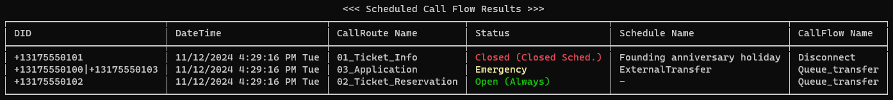

# ScheduleValidator

## 1. Overview

ScheduleValidator is a command-line application designed to validate the scheduling of call routing for Genesys Cloud.
This tool allows you to verify the status of a call flow for a specific date and time by specifying either the DID, date and time, call route name, or call flow name.
For batch verification, you have the option to provide a CSV file containing the DIDs and the corresponding dates and times you wish to validate.
The results of the verification can then be saved to a CSV file for further review and analysis.

## 2. Installation

1. Install, or validate installed, .NET 6.0 (required)
    https://aka.ms/dotnet-core-applaunch?framework=Microsoft.NETCore.App&framework_version=6.0.0&arch=x64&rid=win10-x64
2. Download the latest binary from [Releases](https://github.com/tishige/ScheduleValidator/releases) page
3. Create ScheduleValidator folder
4. Unzip ScheduleValidator.ZIP to ScheduleValidator folder
5. Create or Copy a ClientID and Client Secret of Client Credentials in Genesys Cloud.  Required role is "admin" or permissions are  routing:callRoute:view / routing:emergencyGroup:view / routing:scheduleGroup:view / routing:schedule:view
6. Replace ClientID and Client Secret with your actual values in .\config.toml or specify the file path of existing config.toml in appsettings.json `"gcProfileFileName": "C:\\Users\\YourUserName\\.gc\\config.toml",`

## 3. How to use

_Note: Replace sample values for org name, flow name with your actual values._

- Display the schedule and status that would be in effect if an incoming call were to be received on DID '3175551234' at the current date and time. 
  `ScheduleValidator.exe -D 3175551234`
- Display the schedule and status that would be in effect if an incoming call were received on December 31, 2024, at 23:00. 
  `ScheduleValidator.exe -d 20241231 -t 23000`
- Display the schedule and status that would be in effect if an incoming call were received at the 'ticket_info' in the 'ABC' organization on December 31, 2024, at 23:00. 
  `ScheduleValidator.exe -d 20241231 -t 23000 -F ticket_info -p ABC`
- Display the schedule and status that would be in effect if an incoming call were received at the 'ticket_info' in the 'ABC' organization AND the DID '+13175551234' on December 31, 2024, at 23:00. 
  `ScheduleValidator.exe -d 20241231 -t 23000 -F ticket_info -p ABC -D +13175551234`
- Display the schedule and status that would be in effect if an incoming call were received on December 31, 2024, at 23:00, and save the result as 'test.csv' in the CSV folder. 
  `ScheduleValidator.exe -d 20241231 -t 23000 -o test.csv`
- Load 'TestParam.csv' from ScheduleValidator.exe and display the validation results. 
  `ScheduleValidator.exe -i TestParam.csv.`

#### Command Line argument

| Argument | Description                                                                                                           |
| -------- | --------------------------------------------------------------------------------------------------------------------- |
| -C       | Specifies the call route name. Displays the status of the specified call route.                                       |
| -D       | Specifies the DID number. Displays the status of the call route for the specified DID number.                         |
| -F       | Specifies the call flow name. Displays the status of the call routing settings where the specified call flow is used. |
| -d       | Displays the status of the call route for the specified date.                                                         |
| -t       | Displays the status of the call route for the specified time.                                                         |
| -i       | Specifies the path and file name of the CSV file for batch checking                                                   |
| -o       | Specifies the file name for the CSV file with the validation results.                                                 |

## 4. Customize file format and style

Change config values in appsettings.json

| Variables                   | Description                                                                                    | Default |
| --------------------------- | ---------------------------------------------------------------------------------------------- | ------- |
| convertToE164               | Automatically converts the DID number to the E.164 format if it is not already in that format. | false   |
| countryCode                 | Sets the country code to be added when converting to the E.164 format.                         | +1      |
| removeFirstDigitIfStartWith | Specifies the leading number to be removed in order to convert to the E.164 format.            | 0       |

## 5. Validation Results

| Item           | Value                   | Remarks                                                                                |
| -------------- | ----------------------- | -------------------------------------------------------------------------------------- |
| DID            | Related DID             | If multiple DIDs are set, they are displayed separated by a pipe.                      |
| DateTime       | DateTime                |                                                                                        |
| CallRoute Name | CallRoute Name          |                                                                                        |
| Status         | CallRouting Status      |                                                                                        |
|                | Open (Always)           | CallRoute is set to Always, hence it's in Open status.                                 |
|                | Open                    | CallRoute is in the time range set to Open, hence it's in Open status.                 |
|                | Closed (Open Shced.)    | CallRoute is outside the time range of the Open schedule, hence it's in Closed status. |
|                | Closed (Holiday Sched.) | Matches the Holiday Schedule, hence it's in Closed status.                             |
|                | Closed (Closed Sched.)  | Matches the Closed Schedule, hence it's in Closed status.                              |
|                | Emergency               | Emergency mode is active.                                                              |
|                | Not Found               | Not found.                                                                             |
| Schedule Name  | Schedule Name           |                                                                                        |
| CallFlow Name  | CallFlow Name           |                                                                                        |
